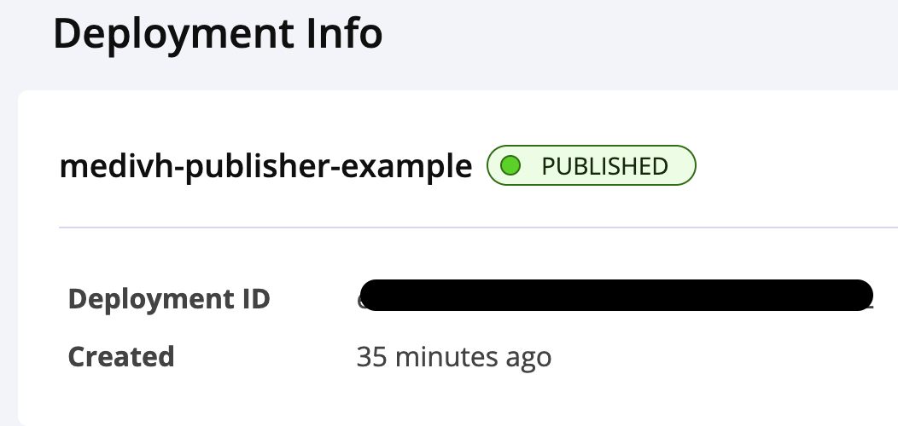

<p align="center">
  <a href="https://medivh.tech/en/" target="_blank" rel="noopener noreferrer">
    
  </a>
</p>
<br/>

## 📷 Medivh-Publisher

> Medivh-publisher is a Gradle plugin designed to publish Gradle projects to the Maven Central Repository. This plugin allows you to perform a complete publication without needing to consult any official documentation.

## Requirements
> There are two private configurations that every publisher must have.

- `Sonatype 📄` - This is a username and password that is used to authenticate the user when uploading the artifacts to the Maven Central Repository.
- `GPG 🔑` - This is a private key that is used to sign the artifacts that are uploaded to the Maven Central Repository.

<details>
  <summary>📄 Sonatype Configuration Guide</summary>
    
1. Register an account on the https://central.sonatype.com/  (if you don’t have one).

2. Create a name space on the https://central.sonatype.com/publishing/namespaces. The purpose of this step is to prove that you own a domain name that can be published. (which will eventually be the groupId of the published Maven repository,You can directly use GitHub's domain name like: io.github.your-username).
3. Create a token on the https://central.sonatype.com/account. This token will be used to authenticate the user when uploading the artifacts to the Maven Central Repository.
You will get a like this:
```xml
<server>
 <username>username</username>
 <password>password</password>
</server>
```
remember the `username` and `password`.
For security reasons, we store this token in Gradle’s local configuration file (usually located at ~/.gradle/gradle.properties).
```properties
sonatypeUsername=username
sonatypePassword=password
```

> 💯You have completed all the Sonatype configurations.

</details>

<details>
  <summary>🔑 GPG Configuration Guide</summary>

1. You need to refer to the documentation to download the appropriate GnuPG for your system. [link](https://gnupg.org/download/index.html)
2. Open the software you just installed, create a key pair, and upload the public key.
</details>


## Quick Start

> ⚠️ Please ensure that you have the required configurations before proceeding.


in your `build.gradle.kts` file, add the following code:

```kotlin
plugins {
    id("tech.medivh.plugin.publisher") version "0.0.1"
    // other plugin ...
}
```
<br/>

😺 That's right, you read that correctly. Other than `tech.medivh.plugin.publisher`, you don’t need to include any other plugins.

<br/>

Open your terminal and execute `./gradlew publishDeployment.`

<br/>
😺 Exactly, you don’t even need any configuration.
<br/>

you will see the following output in [sonatype](https://central.sonatype.com/publishing/deployments):


